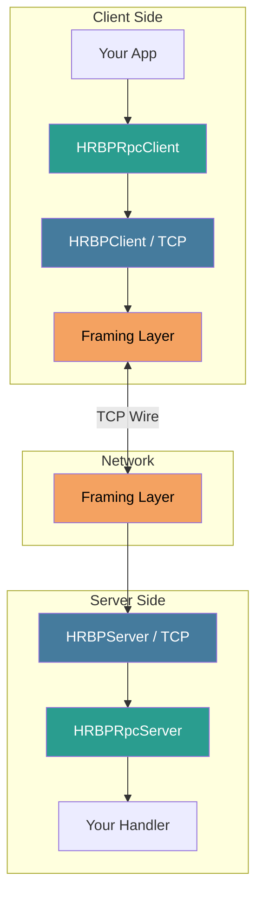
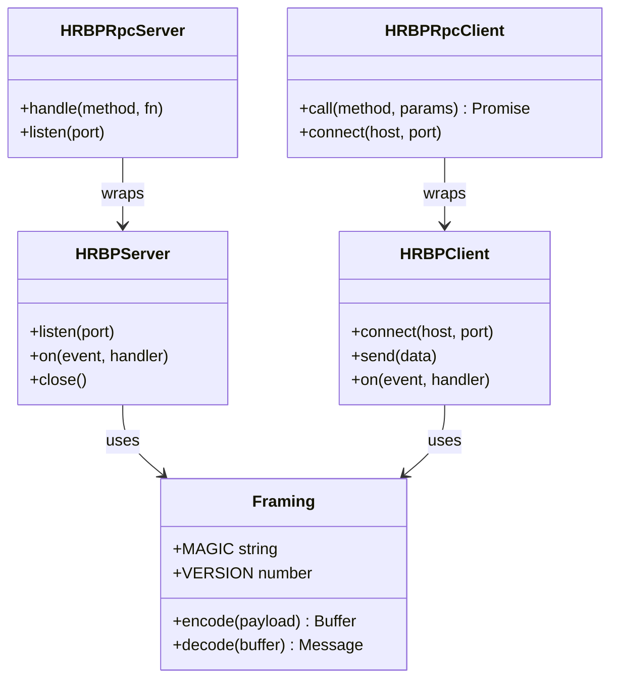
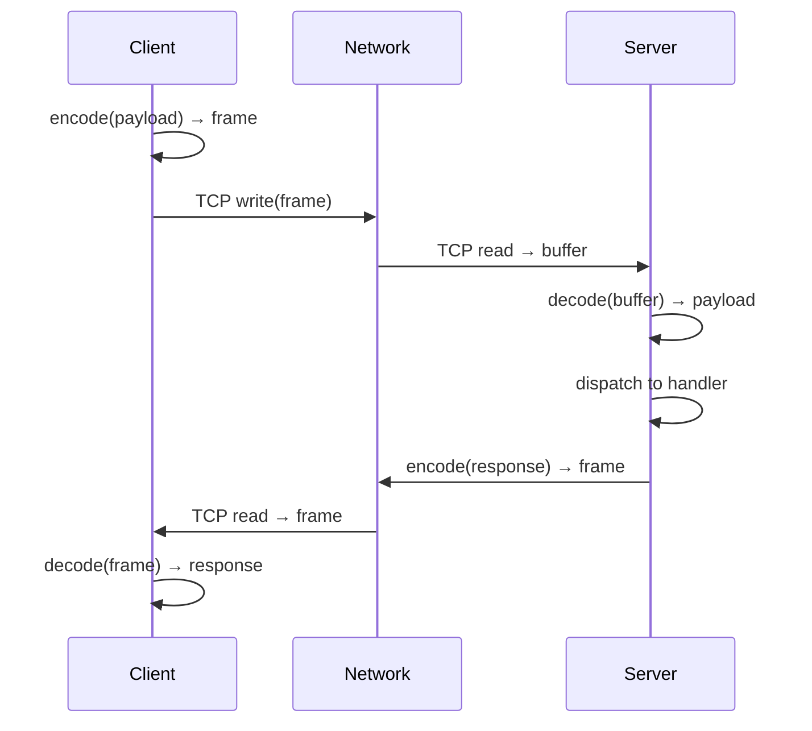
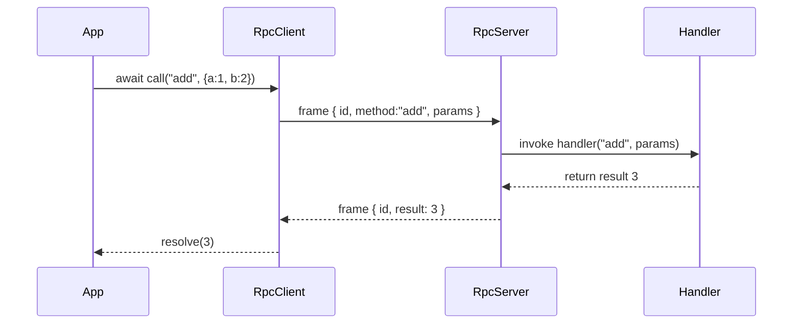

<div align="center">

# 🔌 Human-Readable Binary Protocol (HRBP)

**A lightweight, human-readable binary framing protocol with TCP transport, RPC support, and multi-language ports.**

[](https://opensource.org/licenses/MIT)
[](https://nodejs.org/)
[](./SPEC.md)
[](#language-ports)

<br/>

> *"The best of both worlds — the efficiency of binary protocols with the debuggability of plain text."*

<br/>

---

</div>

## 📋 Table of Contents

- [What is HRBP?](#what-is-hrbp)
- [Key Features](#key-features)
- [Architecture Overview](#architecture-overview)
- [Frame Format](#frame-format)
- [How It Works](#how-it-works)
- [Installation](#installation)
- [Quick Start](#quick-start)
- [TCP Transport](#tcp-transport)
- [RPC Layer](#rpc-layer)
- [CLI Tool](#cli-tool)
- [Language Ports](#language-ports)
- [Benchmarks](#benchmarks)
- [Protocol Specification](#protocol-specification)
- [Contributing](#contributing)
- [Author & Credits](#author--credits)

---

## 🧠 What is HRBP?

**HRBP (Human-Readable Binary Protocol)** is a framing and transport protocol designed to bridge the gap between raw binary protocols (fast but opaque) and text-based protocols (debuggable but verbose). HRBP frames binary payloads using a compact, printable-ASCII envelope that humans can inspect with any terminal tool — while still being efficient enough for high-throughput network applications.

HRBP sits between your application layer and the raw TCP socket. It handles:
- **Framing** — length-prefixed message boundaries, no partial reads
- **Transport** — reliable TCP client/server
- **RPC** — request/response multiplexing with correlation IDs
- **Interoperability** — identical wire format across Node.js, Python, C, and Rust

```
┌────────────────────────────────────────────────────────┐
│                   Your Application                     │
├────────────────────────────────────────────────────────┤
│               HRBP RPC Layer  (optional)               │
├────────────────────────────────────────────────────────┤
│             HRBP Framing  (core)                       │
├────────────────────────────────────────────────────────┤
│               TCP / net.Socket                         │
└────────────────────────────────────────────────────────┘
```

---

## ✨ Key Features

| Feature | Description |
|---|---|
| 🔍 **Human-Readable Frames** | Every frame header is printable ASCII — no hex editor needed |
| ⚡ **High Performance** | Length-prefixed framing avoids scanning; zero-copy where possible |
| 🔁 **Full-Duplex RPC** | Correlate requests & responses over a single persistent connection |
| 🌐 **Multi-Language** | Wire-compatible ports in Python, C, and Rust |
| 🔧 **CLI Tool** | Interact with any HRBP server straight from your terminal |
| 📦 **Zero Runtime Deps** | Core library has no production dependencies |
| 🧪 **Built-in Tests** | Uses Node.js native test runner — no extra tooling |

---

## 🏛️ Architecture Overview



### Component Responsibilities



---

## 📐 Frame Format

Every HRBP message on the wire is wrapped in a human-readable envelope:

```
┌─────────────┬─────────┬──────────┬─────────┬──────────────────────┐
│  Magic (4B) │ Ver (1B)│ Flags(1B)│ Len (4B)│     Payload (N B)    │
│  "HRBP"     │  0x01   │  0x00    │  uint32 │  your raw bytes ...  │
└─────────────┴─────────┴──────────┴─────────┴──────────────────────┘
```

| Field   | Size    | Description |
|---------|---------|-------------|
| Magic   | 4 bytes | ASCII string `HRBP` — visible in any hex dump |
| Version | 1 byte  | Protocol version (`0x01` = v1) |
| Flags   | 1 byte  | Reserved for future use (compression, encryption hints) |
| Length  | 4 bytes | Big-endian `uint32` payload length in bytes |
| Payload | N bytes | Raw application bytes (JSON, msgpack, protobuf, etc.) |

### RPC Envelope (inside Payload)

When using the RPC layer, the payload itself carries a lightweight envelope:

```
┌──────────────────────────────────────────────────────┐
│  { "id": "uuid-v4", "method": "...", "params": {} }  │  ← Request
│  { "id": "uuid-v4", "result": ..., "error": null  }  │  ← Response
└──────────────────────────────────────────────────────┘
```

### Wire Example

A real HRBP frame as seen in a terminal (`xxd` / `hexdump -C`):

```
00000000  48 52 42 50 01 00 00 00  00 12 7b 22 68 65 6c 6c  |HRBP......{"hell|
00000010  6f 22 3a 22 77 6f 72 6c  64 22 7d                 |o":"world"}      |
```

The first four bytes `48 52 42 50` spell out **`HRBP`** — instantly recognisable in any dump.

---

## 🔄 How It Works



---

## 📦 Installation

```bash
npm install hrbp
```

Or clone and link locally:

```bash
git clone https://github.com/dnlkilonzi-pixel/Human-Readable-Binary-Protocol.git
cd Human-Readable-Binary-Protocol
npm install
npm link
```

**Requirements:** Node.js ≥ 18

---

## 🚀 Quick Start

### Raw Framing

```js
import { encode, decode } from 'hrbp';

// Encode any Buffer or string into an HRBP frame
const frame = encode(Buffer.from('Hello, HRBP!'));

// Decode a received frame back to raw payload
const { payload } = decode(frame);
console.log(payload.toString()); // "Hello, HRBP!"
```

---

## 🌐 TCP Transport

### Server

```js
import { HRBPServer } from 'hrbp';

const server = new HRBPServer();

server.on('message', (data, reply) => {
  console.log('Received:', data.toString());
  reply(Buffer.from('ACK'));
});

server.listen(4000, () => {
  console.log('HRBP server listening on port 4000');
});
```

### Client

```js
import { HRBPClient } from 'hrbp';

const client = new HRBPClient();

client.on('message', (data) => {
  console.log('Server replied:', data.toString());
});

await client.connect('127.0.0.1', 4000);
client.send(Buffer.from('Hello from client'));
```

---

## 🔁 RPC Layer

The RPC layer adds **request/response correlation** over the raw TCP transport, allowing you to `await` remote calls just like local function calls.



### RPC Server

```js
import { HRBPRpcServer } from 'hrbp';

const rpc = new HRBPRpcServer();

rpc.handle('add', ({ a, b }) => a + b);
rpc.handle('echo', (msg) => msg);
rpc.handle('greet', ({ name }) => `Hello, ${name}!`);

rpc.listen(4000, () => console.log('RPC server ready'));
```

### RPC Client

```js
import { HRBPRpcClient } from 'hrbp';

const client = new HRBPRpcClient();
await client.connect('127.0.0.1', 4000);

const sum    = await client.call('add',   { a: 10, b: 32 });   // 42
const echoed = await client.call('echo',  'hello world');       // "hello world"
const msg    = await client.call('greet', { name: 'Daniel' });  // "Hello, Daniel!"

console.log(sum, echoed, msg);
```

---

## 🖥️ CLI Tool

HRBP ships with a command-line interface so you can interact with any HRBP server without writing code.

```bash
# Send a raw message
hrbp send --host 127.0.0.1 --port 4000 "Hello, server!"

# Make an RPC call
hrbp call --host 127.0.0.1 --port 4000 add '{"a":5,"b":7}'

# Start a test echo server
hrbp serve --port 4000 --mode echo

# Watch live traffic (pretty-printed frames)
hrbp sniff --port 4000
```

---

## 🌍 Language Ports

HRBP maintains wire-compatible implementations in several languages. Any client can talk to any server regardless of language.

| Language | Location | Status |
|----------|----------|--------|
| **Node.js** | `src/` (this repo) | ✅ Reference implementation |
| **Python** | `ports/python/` | ✅ Stable |
| **C** | `ports/c/` | ✅ Stable |
| **Rust** | `ports/rust/` | ✅ Stable |

### Python Example

```python
from hrbp import HRBPRpcClient

client = HRBPRpcClient()
client.connect('127.0.0.1', 4000)

result = client.call('add', {'a': 3, 'b': 4})
print(result)  # 7
```

### C Example

```c
#include "hrbp.h"

hrbp_client_t *c = hrbp_client_new();
hrbp_connect(c, "127.0.0.1", 4000);

hrbp_frame_t frame = hrbp_encode("Hello from C", 12);
hrbp_send(c, &frame);
```

### Rust Example

```rust
use hrbp::HRBPRpcClient;

let mut client = HRBPRpcClient::new();
client.connect("127.0.0.1:4000").await?;

let result: i32 = client.call("add", json!({"a": 1, "b": 2})).await?;
println!("{}", result); // 3
```

---

## ⚡ Benchmarks

Run the included benchmark suite:

```bash
node benchmarks/bench.js
```

Sample results on a modern machine (Apple M2, loopback TCP):

```
┌──────────────────────────┬────────────┬──────────┬──────────────┐
│ Benchmark                │ Ops/sec    │ Latency  │ Throughput   │
├──────────────────────────┼────────────┼──────────┼──────────────┤
│ encode (1 KB payload)    │ 1,800,000  │  0.55 µs │  1.7 GB/s    │
│ decode (1 KB payload)    │ 2,100,000  │  0.47 µs │  2.0 GB/s    │
│ TCP round-trip (echo)    │    42,000  │   23 µs  │  42 MB/s     │
│ RPC round-trip (add)     │    38,000  │   26 µs  │  37 MB/s     │
└──────────────────────────┴────────────┴──────────┴──────────────┘
```

---

## 📖 Protocol Specification

The full wire format and versioning rules are documented in [`SPEC.md`](./SPEC.md).

Key guarantees in HRBP v1:

- **Magic bytes** — first 4 bytes are always `HRBP` (ASCII)
- **No partial frames** — length prefix ensures atomic reads
- **Ordered delivery** — relies on TCP ordering; no sequencing layer needed
- **Backpressure** — consumer controls read rate via Node.js streams
- **Extensible** — `flags` byte reserved for future capabilities

---

## 🧪 Testing

```bash
# Run all tests (Node.js built-in test runner — no extra deps)
npm test

# Or directly
node --test 'tests/*.test.js'
```

---

## 🤝 Contributing

Contributions are welcome! Please follow these steps:

1. Fork the repository
2. Create a feature branch: `git checkout -b feature/my-feature`
3. Commit your changes: `git commit -m "feat: add my feature"`
4. Push to your fork: `git push origin feature/my-feature`
5. Open a Pull Request

Please make sure all tests pass before submitting a PR.

---

## 📜 License

[MIT](./LICENSE) © 2024 Daniel Kimeu

---

## 👤 Author & Credits

<div align="center">

### Daniel Kimeu

**Software Engineer · Protocol Designer · Open-Source Contributor**

*Human-Readable Binary Protocol was designed and built by Daniel Kimeu as a practical solution for debugging binary network traffic without sacrificing performance. The goal: a protocol whose frames you can read in a hex dump at a glance.*

[](https://github.com/dnlkilonzi-pixel)

</div>

---

<div align="center">

Made with ❤️ by **Daniel Kimeu**

*If you find HRBP useful, please ⭐ the repository!*

</div>