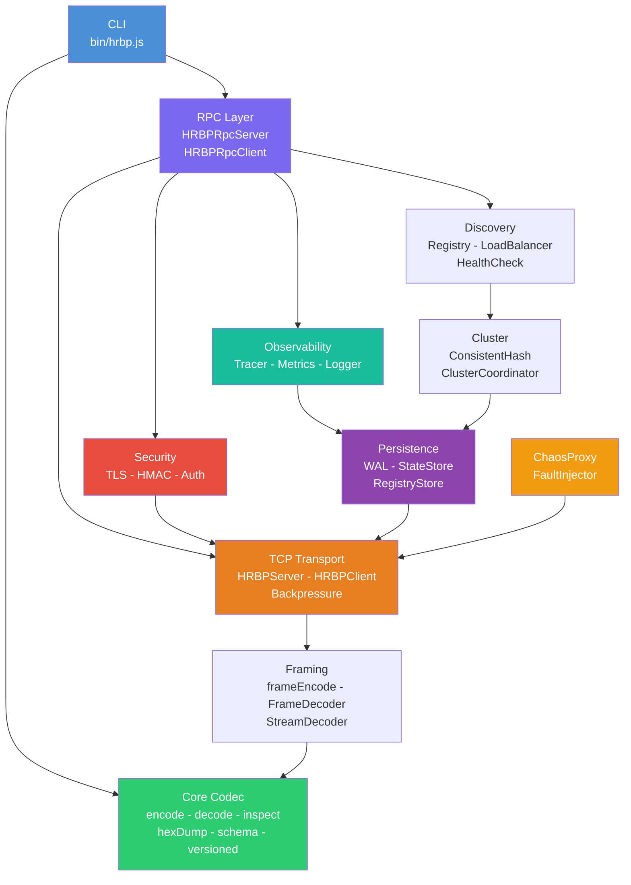
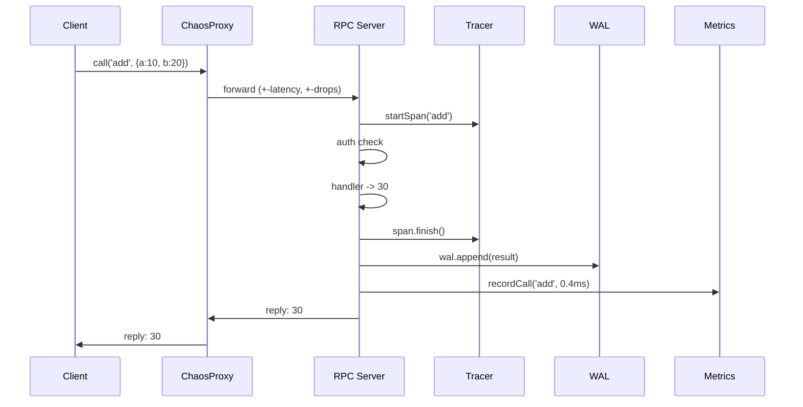

<div align="center">

```
  _   _ ____  ____  ____  
 | | | |  _ \| __ )|  _ \ 
 | |_| | |_) |  _ \| |_) |
 |  _  |  _ <| |_) |  __/ 
 |_| |_|_| \_\____/|_|    
```

# Human-Readable Binary Protocol

**Binary speed. Human readability. Zero dependencies.**

[](#running-tests)
[](#license)
[](#installation)
[](#installation)
[](#language-ports)

*Designed and built entirely by **[Daniel Kimeu](https://github.com/dnlkilonzi-pixel)***

</div>

---

## What Is HRBP?

HRBP is a **debuggable binary format** — every type tag is a printable ASCII character (`I`, `S`, `{`, `[`, ...) so raw wire bytes are **partially human-readable in any hex dump with no decoder needed**.

```
encode({ name: 'Alice', age: 30 })

00000000  7b 00 00 00 02 53 00 00  00 04 6e 61 6d 65 53 00  |{....S....nameS.|
00000010  00 00 05 41 6c 69 63 65  49 00 00 00 1e            |...AliceI...|
          ^^                        ^^                        ^^
          {  = OBJECT tag           S  = STRING tag           I  = INT32 tag
```

Start here for the simplest use — then adopt the RPC / clustering stack only when you need it.

---

## Start Here — Core Codec (30 seconds)

```js
const { encode, decode, inspect, hexDump } = require('human-readable-binary-protocol');

// Encode any JS value to a compact binary Buffer
const buf = encode({ name: 'Alice', age: 30, active: true });

// Decode back to JS
console.log(decode(buf));
// { name: 'Alice', age: 30, active: true }

// Human-readable tree — great for debugging
console.log(inspect(buf));
// { (3 pairs)
//   S(4) "name"
//     S(5) "Alice"
//   S(3) "age"
//     I 30
//   S(6) "active"
//     T true
// }

// Hex dump — ASCII tags are visible in the rightmost column
console.log(hexDump(buf));
// 00000000  7b 00 00 00 03 53 00 00  00 04 6e 61 6d 65 53 00  |{....S....nameS.|
// ...
```

**TypeScript** — full declarations are included:

```ts
import { encode, decode, inspect, hexDump } from 'human-readable-binary-protocol';
const buf: Buffer = encode({ hello: 'world' });
```

---

## Table of Contents

1. [Why HRBP?](#why-hrbp)
2. [Architecture](#architecture)
3. [Data Flow](#data-flow)
4. [Wire Format](#wire-format)
5. [Installation](#installation)
6. [Quick Start](#quick-start)
7. [Interoperability Bridges](#interoperability-bridges)
8. [TypeScript](#typescript)
9. [Browser Support](#browser-support)
10. [Deno Support](#deno-support)
11. [CLI Reference](#cli-reference)
12. [API Reference](#api-reference)
13. [Language Ports](#language-ports)
14. [Performance](#performance)
15. [Running Tests](#running-tests)
16. [Project Structure](#project-structure)
17. [Credits](#credits)

---

## Why HRBP?

| Concern | JSON | MessagePack / Protobuf | **HRBP** |
|---------|:----:|:---------------------:|:--------:|
| Wire speed | ❌ Slow | ✅ Fast | ✅ Fast |
| Human-readable in hex dump | ✅ | ❌ Opaque | ✅ ASCII tags visible |
| External tooling required | none | ✅ Needs schema decoder | ✅ `xxd` is enough |
| Schema / IDL | ❌ None | ✅ Protobuf IDL | ✅ Built-in IDL |
| Native RPC | ❌ | ❌ Needs gRPC | ✅ `HRBPRpcServer` |
| Distributed tracing | ❌ | ❌ | ✅ Built-in spans |
| Metrics & structured logs | ❌ | ❌ | ✅ Built-in |
| Service discovery | ❌ | ❌ | ✅ `ServiceRegistry` |
| Horizontal scaling | ❌ | ❌ | ✅ Consistent hash ring |
| Crash-safe persistence | ❌ | ❌ | ✅ WAL + state store |
| Chaos / fault injection | ❌ | ❌ | ✅ `ChaosProxy` |
| TLS + HMAC auth | ❌ | ❌ | ✅ Built-in |
| Zero runtime dependencies | ✅ | ❌ | ✅ Node.js built-ins only |

---

## Architecture

```
+-----------------------------------------------------------------------------+
|                           HRBP Production Stack                             |
|                      by Daniel Kimeu (@dnlkilonzi-pixel)                    |
+-----------------------------------------------------------------------------+
|                                                                             |
|  +------------------------------------------------------------------------+ |
|  |  CLI  bin/hrbp.js                                                      | |
|  |  inspect  hexdump  encode  decode  serve  ping  version                | |
|  +------------------------------------------------------------------------+ |
|                                                                             |
|  +---------------------------+  +------------------------------------------+|
|  |  Developer Tools          |  |  Security                                ||
|  |  IDL  schema  inspector   |  |  TLS  HMAC signing  token auth           ||
|  +---------------------------+  +------------------------------------------+|
|                                                                             |
|  +------------------------------------------------------------------------+ |
|  |  RPC Layer   HRBPRpcServer / HRBPRpcClient                             | |
|  |  middleware:  auth -> rate-limit -> signing -> tracing -> handler      | |
|  +------------------------------------------------------------------------+ |
|                                                                             |
|  +--------------------+  +--------------------+  +------------------------+|
|  |  Observability     |  |  Service Discovery |  |  Cluster / Scaling     ||
|  |  Tracer            |  |  ServiceRegistry   |  |  ConsistentHash        ||
|  |  MetricsCollector  |  |  LoadBalancer      |  |  ClusterCoordinator    ||
|  |  Logger            |  |  HealthCheck       |  |                        ||
|  +--------------------+  +--------------------+  +------------------------+|
|                                                                             |
|  +---------------------------+  +------------------------------------------+|
|  |  Persistence              |  |  Chaos Testing                           ||
|  |  WAL  RegistryStore       |  |  ChaosProxy  FaultInjector               ||
|  |  StateStore               |  |  corruptBuffer                           ||
|  +---------------------------+  +------------------------------------------+|
|                                                                             |
|  +------------------------------------------------------------------------+ |
|  |  TCP Transport   HRBPServer  HRBPClient  BackpressureController        | |
|  +------------------------------------------------------------------------+ |
|                                                                             |
|  +------------------------------------------------------------------------+ |
|  |  Framing / Codec   frameEncode  FrameDecoder  StreamDecoder            | |
|  +------------------------------------------------------------------------+ |
|                                                                             |
|  +------------------------------------------------------------------------+ |
|  |  Core Codec                                                            | |
|  |  encode  decode  inspect  hexDump  versioned  compress  schema         | |
|  +------------------------------------------------------------------------+ |
+-----------------------------------------------------------------------------+
```

### Component diagram (Mermaid — rendered on GitHub)



---

## Data Flow

### RPC call with tracing, persistence, and cluster routing

```
+----------+                   +---------------------------------------------------+
|  Client  |                   |        Server (RPC middleware chain)              |
+----+-----+                   +--------------------+------------------------------+
     |                                              |
     |  call('add', { a: 10, b: 20 })              |
     |  -> encode HRBP envelope                     |
     |  -> frameEncode (length prefix)              |
     | -------------------------------------------> |
     |                                              |
     |                                              | [1] auth middleware
     |                                              |     verify HMAC token
     |                                              |
     |                                              | [2] rate-limiter
     |                                              |     check req/s window
     |                                              |
     |                                              | [3] tracer.startSpan('add') -----> InMemoryCollector
     |                                              |
     |                                              | [4] logger.info('rpc:call') -----> structured log sink
     |                                              |
     |                                              | [5] cluster.route('add') --------> ConsistentHash ring
     |                                              |
     |                                              | [6] handler: add({ a, b }) -> 30
     |                                              |
     |                                              | [7] span.finish() ---------------> collector.record(span)
     |                                              |
     |                                              | [8] wal.append({ method, result }) -> /var/data/hrbp.wal
     |                                              |
     |                                              | [9] metrics.recordCall('add', 0.4ms)
     |                                              |
     | <------------------------------------------- |
     |  reply envelope: result = 30                 |
```

### Sequence diagram (Mermaid — rendered on GitHub)



---

## Wire Format

Every encoded value is a **1-byte ASCII type tag** followed by a type-specific payload.

```
  +-----------------------------------------------------------------------+
  |  Every HRBP value on the wire                                         |
  |                                                                       |
  |   +--------+----------------------------------------------------------+
  |   |  tag   |                    payload                               |
  |   | 1 byte |             (type-dependent length)                      |
  |   +--------+----------------------------------------------------------+
  +-----------------------------------------------------------------------+
```

### Type tags

| Tag | Hex  | JS type   | Payload layout                                           |
|:---:|:----:|-----------|----------------------------------------------------------|
| `I` | 0x49 | integer   | `[tag][---- int32 big-endian 4 bytes ----]`              |
| `F` | 0x46 | float     | `[tag][-------- float64 big-endian 8 bytes --------]`    |
| `S` | 0x53 | string    | `[tag][uint32 len 4 bytes][UTF-8 bytes]`                 |
| `T` | 0x54 | `true`    | `[tag]` no payload                                       |
| `X` | 0x58 | `false`   | `[tag]` no payload                                       |
| `N` | 0x4E | `null`    | `[tag]` no payload                                       |
| `[` | 0x5B | Array     | `[tag][uint32 count 4][element0][element1]...`           |
| `{` | 0x7B | Object    | `[tag][uint32 pairs 4][keyS0][val0][keyS1][val1]...`     |
| `B` | 0x42 | Buffer    | `[tag][uint32 len 4][raw bytes]`                         |
| `H` | 0x48 | version   | `[tag][version 1 byte][HRBP payload...]`                 |

### Anatomy of an encoded object

The ASCII type tags (`{`, `S`, `I`, `T`) appear verbatim in the rightmost column of the hex dump — readable in any terminal or hex editor with no decoder needed.

```
encode({ name: 'Alice', age: 30, active: true })
                                          49 bytes total

 Offset  Hex bytes                          Meaning
 ------  ---------------------------------  --------------------------
   0     7b                                 { tag  -> Object
   1-4   00 00 00 03                        3 key-value pairs
   5     53                                 S tag  -> key "name"
   6-9   00 00 00 04                        4 bytes long
  10-13  6e 61 6d 65                        n a m e
  14     53                                 S tag  -> value "Alice"
  15-18  00 00 00 05                        5 bytes long
  19-23  41 6c 69 63 65                     A l i c e
  24     53                                 S tag  -> key "age"
  25-28  00 00 00 03                        3 bytes long
  29-31  61 67 65                           a g e
  32     49                                 I tag  -> value 30
  33-36  00 00 00 1e                        0x1e = 30
  37     53                                 S tag  -> key "active"
  38-41  00 00 00 06                        6 bytes long
  42-47  61 63 74 69 76 65                  a c t i v e
  48     54                                 T tag  -> true
```

**Hex dump output (what you see in the terminal):**

```
00000000  7b 00 00 00 03 53 00 00  00 04 6e 61 6d 65 53 00  |{....S....nameS.|
00000010  00 00 05 41 6c 69 63 65  53 00 00 00 03 61 67 65  |...AliceS....age|
00000020  49 00 00 00 1e 53 00 00  00 06 61 63 74 69 76 65  |I....S....active|
00000030  54                                                 |T|
```

### Versioned frame hex dump

```
encodeVersioned({ event: 'login', userId: 42 })

00000000  48 01 7b 00 00 00 02 53  00 00 00 05 65 76 65 6e  |H.{....S....even|
00000010  74 53 00 00 00 05 6c 6f  67 69 6e 53 00 00 00 06  |tS....loginS....|
00000020  75 73 65 72 49 64 49 00  00 00 2a                 |userIdI...*|
          ^  ^  ^
          |  |  +-- HRBP object payload
          |  +----- version = 1
          +-------- 'H' version header tag (0x48)
```

---

## Installation

```sh
npm install human-readable-binary-protocol
```

Or from source:

```sh
git clone https://github.com/dnlkilonzi-pixel/Human-Readable-Binary-Protocol.git
cd Human-Readable-Binary-Protocol
npm test   # 362 tests, zero dependencies
```

---

## Quick Start

### 1 — Core codec

```js
const { encode, decode, inspect, hexDump } = require('human-readable-binary-protocol');

const buf = encode({ name: 'Alice', age: 30, active: true });

console.log(decode(buf));
// { name: 'Alice', age: 30, active: true }
```

**Terminal — `inspect(buf)`:**

```
$ node -e "const {encode,inspect}=require('.'); console.log(inspect(encode({name:'Alice',age:30,active:true})))"

{ (3 pairs)
  S(4) "name"
    S(5) "Alice"
  S(3) "age"
    I 30
  S(6) "active"
    T true
}
```

**Terminal — `hexDump(buf)`:**

```
$ node -e "const {encode,hexDump}=require('.'); console.log(hexDump(encode({name:'Alice',age:30,active:true})))"

00000000  7b 00 00 00 03 53 00 00  00 04 6e 61 6d 65 53 00  |{....S....nameS.|
00000010  00 00 05 41 6c 69 63 65  53 00 00 00 03 61 67 65  |...AliceS....age|
00000020  49 00 00 00 1e 53 00 00  00 06 61 63 74 69 76 65  |I....S....active|
00000030  54                                                 |T|
```

**Terminal — arrays and mixed values:**

```
$ node -e "const {encode,inspect}=require('.'); console.log(inspect(encode([1,'hello',null,true,3.14])))"

[ (5 elements)
  I 1
  S(5) "hello"
  N null
  T true
  F 3.14
]
```

---

### 2 — RPC server and client

```js
const { HRBPRpcServer, HRBPRpcClient, attachHealthCheck } = require('human-readable-binary-protocol');

// Server
const server = new HRBPRpcServer();
attachHealthCheck(server, { serviceName: 'calc' });
server.handle('add', async ({ a, b }) => a + b);
server.listen(7001, '127.0.0.1', () =>
  console.log('RPC server listening on :7001'));

// Client
const client = new HRBPRpcClient();
client.connect(7001, '127.0.0.1', async () => {
  const result = await client.call('add', { a: 10, b: 20 });
  console.log(result); // 30

  const health = await client.call('__health', {});
  console.log(health.status); // 'healthy'

  client.close();
  server.close();
});
```

**Terminal output:**

```
RPC server listening on :7001
30
healthy
```

---

### 3 — Observability middleware

```js
const {
  HRBPRpcServer,
  Tracer, InMemoryCollector,
  MetricsCollector,
  Logger,
} = require('human-readable-binary-protocol');

const collector = new InMemoryCollector();
const tracer    = new Tracer({ collector });
const metrics   = new MetricsCollector();
const logger    = new Logger({ level: 'info' });

const server = new HRBPRpcServer();

server.use(async (envelope) => {
  tracer.startSpan(envelope.method, { tags: { id: envelope.id } });
  logger.info('rpc:call', { method: envelope.method });
  return envelope;
});

server.handle('greet', async ({ name }) => `Hello, ${name}!`);
server.listen(7001);
```

**Log sink output:**

```
{"level":"info","ts":1712112000000,"msg":"rpc:call","method":"greet"}
```

**Metrics snapshot:**

```js
metrics.snapshot();
// {
//   totalCalls: 5,
//   methods: {
//     greet: { calls: 5, errors: 0, totalMs: 2.1, avgMs: 0.42 }
//   }
// }
```

---

### 4 — Chaos testing

```js
const { ChaosProxy, HRBPRpcClient } = require('human-readable-binary-protocol');

const proxy = new ChaosProxy({
  target:      { host: '127.0.0.1', port: 7001 },
  latency:     { min: 20, max: 80 },  // inject 20-80 ms delay
  dropRate:    0.05,                   // 5%  packet loss
  corruptRate: 0.01,                   // 1%  frame corruption
});

await proxy.listen(9001);

const client = new HRBPRpcClient();
client.connect(9001, '127.0.0.1', async () => {
  const result = await client.call('add', { a: 1, b: 2 }); // 3
  console.log(proxy.stats);
  // { forwarded: 1, dropped: 0, corrupted: 0, reset: 0, delayed: 1 }
  await proxy.close();
  client.close();
});
```

---

### 5 — Service discovery and load balancing

```js
const { ServiceRegistry, LoadBalancer } = require('human-readable-binary-protocol');

const registry = new ServiceRegistry();
registry.register({ name: 'calc', host: '10.0.0.1', port: 7001, tags: ['v2'] });
registry.register({ name: 'calc', host: '10.0.0.2', port: 7001, tags: ['v2'] });
registry.register({ name: 'calc', host: '10.0.0.3', port: 7001, tags: ['v2'] });

const lb = new LoadBalancer({ strategy: 'round-robin' });
for (const inst of registry.lookup('calc', { tags: ['v2'] })) {
  lb.addInstance(inst);
}

lb.pick(); // { host: '10.0.0.1', port: 7001, pending: 0 }
lb.pick(); // { host: '10.0.0.2', port: 7001, pending: 0 }
lb.pick(); // { host: '10.0.0.3', port: 7001, pending: 0 }
```

---

### 6 — Horizontal scaling

```js
const { ConsistentHash } = require('human-readable-binary-protocol');

const ring = new ConsistentHash(150); // 150 virtual nodes per real node
ring.addNode('node-1');
ring.addNode('node-2');
ring.addNode('node-3');

ring.getNode('user:42');   // -> 'node-2'  (deterministic)
ring.getNode('user:99');   // -> 'node-1'
ring.getNode('session:X'); // -> 'node-3'

// Remove a node -- only ~1/3 of keys reroute
ring.removeNode('node-2');
ring.getNode('user:42');   // -> 'node-1'  (minimal disruption)
```

---

### 7 — Persistence (WAL + state store)

```js
const { WAL, StateStore } = require('human-readable-binary-protocol');

const wal = new WAL('/var/data/hrbp.wal');
await wal.open();
await wal.append({ type: 'call', method: 'add', params: { a: 1, b: 2 } });
await wal.append({ type: 'call', method: 'add', params: { a: 3, b: 4 } });

// On restart -- replay all entries
const entries = await wal.replay();
// [
//   { ts: 1712112000000, data: { type: 'call', method: 'add', params: {a:1,b:2} } },
//   { ts: 1712112000042, data: { type: 'call', method: 'add', params: {a:3,b:4} } },
// ]

const store = new StateStore('/var/data/hrbp-state');
await store.open();
await store.set('config', { maxConns: 100 });
const cfg = await store.get('config'); // { maxConns: 100 }
```

---

## Interoperability Bridges

Move data between HRBP and other serialization formats without committing fully to the HRBP wire format.

### JSON ↔ HRBP

```js
const { jsonToHRBP, hrbpToJSON } = require('human-readable-binary-protocol');

// JSON string → HRBP Buffer
const buf = jsonToHRBP('{"name":"Alice","age":30}');

// HRBP Buffer → JSON string
const json = hrbpToJSON(buf);                // '{"name":"Alice","age":30}'
const pretty = hrbpToJSON(buf, true);        // formatted JSON

// Pass a pre-parsed JS object
const buf2 = jsonToHRBP({ items: [1, 2, 3] });
```

Errors:

```js
jsonToHRBP('{bad json}');    // throws SyntaxError: "jsonToHRBP: invalid JSON input — ..."
hrbpToJSON('not a buffer');  // throws TypeError: "hrbpToJSON: first argument must be a Buffer"
hrbpToJSON(Buffer.from([0xff])); // throws RangeError (malformed HRBP)
```

---

### MessagePack ↔ HRBP

**Without a runtime dependency** (value-level helpers):

```js
const { msgpackValueToHRBP, hrbpToMsgpackValue } = require('human-readable-binary-protocol');

const buf = msgpackValueToHRBP({ hello: 'world' });
const val = hrbpToMsgpackValue(buf); // { hello: 'world' }
```

**With a codec** (full encode/decode bridge):

```js
const msgpack = require('@msgpack/msgpack'); // or msgpack-lite / msgpack5
const { createMsgpackBridge } = require('human-readable-binary-protocol');

const bridge = createMsgpackBridge(msgpack);

// MessagePack Buffer → HRBP Buffer
const mpBuf   = msgpack.encode({ hello: 'world' });
const hrbpBuf = bridge.msgpackToHRBP(mpBuf);

// HRBP Buffer → MessagePack Buffer
const mpOut = bridge.hrbpToMsgpack(hrbpBuf);
```

`createMsgpackBridge` accepts any codec that exposes `encode(value)` and `decode(buffer)`.
`Uint8Array` payloads (Protobuf `bytes` or MessagePack `bin` types) are automatically
converted to Node.js `Buffer` instances so HRBP encodes them as `BUFFER` values.

---

### Protobuf ↔ HRBP (partial bridge)

The bridge works via the plain-object boundary that Protobuf libraries expose through
`.toObject()` / `fromObject()`.  No `.proto` file or generated code is needed on the
HRBP side.

```js
const protobuf = require('protobufjs');
const { protobufValueToHRBP, hrbpToProtobufValue } = require('human-readable-binary-protocol');

const root = await protobuf.load('my_schema.proto');
const MyMessage = root.lookupType('MyMessage');

// Protobuf → HRBP
const msg     = MyMessage.decode(protoBytes);
const hrbpBuf = protobufValueToHRBP(msg.toObject());

// HRBP → plain object → Protobuf
const obj  = hrbpToProtobufValue(hrbpBuf);
const msg2 = MyMessage.fromObject(obj);
```

**What is supported vs not supported:**

| Protobuf type | HRBP type | Notes |
|---|---|---|
| `string` | STRING | Lossless |
| `bool` | TRUE/FALSE | Lossless |
| `int32` / `sint32` | INT32 | Lossless within [-2³¹, 2³¹-1] |
| `double` | FLOAT | Lossless |
| `float` | FLOAT | float32 loses precision vs HRBP float64 |
| `bytes` | BUFFER | Uint8Array → Buffer, lossless |
| `repeated` | ARRAY | Lossless |
| nested message | OBJECT | Keys are field names |
| `int64` / `uint64` | FLOAT | JS number; loses precision > 2⁵³ |
| `oneof` | (set field only) | Not preserved as a semantic — just the populated field |
| enums | INT32 | Values encoded as their integer representation |

---

## TypeScript

TypeScript declarations are included in the package — no `@types/` install needed.

```ts
import {
  encode, decode, inspect, hexDump,
  jsonToHRBP, hrbpToJSON,
  msgpackValueToHRBP, hrbpToMsgpackValue, createMsgpackBridge,
  protobufValueToHRBP, hrbpToProtobufValue,
  MsgpackCodec, MsgpackBridge,
  IncompleteBufferError,
} from 'human-readable-binary-protocol';

const buf: Buffer    = encode({ x: 1 });
const val: unknown   = decode(buf);
const tree: string   = inspect(buf);
const hex: string    = hexDump(buf);
const json: string   = hrbpToJSON(buf, true);
```

The `types` field in `package.json` points to `index.d.ts` at the package root.

---

## Browser Support

The **core codec** (`encode`, `decode`, `inspect`, `hexDump`) runs in any modern browser
because it only uses standard JavaScript (`Buffer` is polyfilled by bundlers, or you can
use `Uint8Array` directly).

### With a bundler (webpack / Rollup / Vite / esbuild)

```js
// Works out of the box — bundlers auto-polyfill Buffer via the `buffer` package.
import { encode, decode, inspect, hexDump,
         jsonToHRBP, hrbpToJSON } from 'human-readable-binary-protocol';

const buf = encode({ hello: 'browser' });
console.log(decode(buf)); // { hello: 'browser' }
```

If you see a "Buffer is not defined" error, add the polyfill explicitly:

```sh
npm install buffer
```

```js
import { Buffer } from 'buffer';
globalThis.Buffer = Buffer;
```

### Without a bundler (CDN / ESM script tag)

```html
<script type="module">
  // Use a CDN that serves ESM — e.g. esm.sh or jsDelivr
  import { encode, decode } from 'https://esm.sh/human-readable-binary-protocol';
  const buf = encode({ hello: 'world' });
  console.log(decode(buf));
</script>
```

**What works in the browser:** `encode`, `decode`, `decodeAll`, `inspect`, `hexDump`,
`encodeVersioned`, `decodeVersioned`, all schema helpers, streaming decoder, and all
interop bridge helpers.

**What requires Node.js:** TCP transport (`HRBPServer`, `HRBPClient`), TLS, filesystem
persistence (WAL / StateStore), and the CLI.

---

## Deno Support

HRBP works in Deno via npm compatibility mode (Deno ≥ 1.28) or directly via `esm.sh`.

### Via npm compatibility (recommended for Node-style code)

```ts
// deno.json — add to imports
// "human-readable-binary-protocol": "npm:human-readable-binary-protocol@1.0.0"

import { encode, decode, inspect } from 'human-readable-binary-protocol';

const buf = encode({ hello: 'deno' });
console.log(decode(buf));       // { hello: 'deno' }
console.log(inspect(buf));
```

Run with:

```sh
deno run --allow-read main.ts
```

### Via esm.sh (zero install)

```ts
import { encode, decode } from 'https://esm.sh/human-readable-binary-protocol';

const buf = encode([1, 2, 3]);
console.log(decode(buf)); // [1, 2, 3]
```

**Limitations in Deno:**
- `Buffer` is polyfilled automatically by Deno's npm compatibility layer.
- TCP transport and TLS modules use Node.js `net`/`tls` — these work in Deno's Node compatibility mode but are untested for production use.
- The `hrbp` CLI is Node.js-only; use `deno run` with the API instead.

---

## CLI Reference

### `hrbp --help`

```
$ hrbp --help

hrbp -- Human-Readable Binary Protocol DevTools

Usage:
  hrbp inspect  <file.bin>                  Pretty-print the HRBP structure
  hrbp hexdump  <file.bin>                  Annotated hex dump
  hrbp decode   <file.bin>                  Decode to JSON
  hrbp encode  [--json '<json>']            Encode JSON to HRBP binary (stdout)
  hrbp serve   [--port <n>] [--host <h>]   Start a minimal RPC echo server
  hrbp ping    [--port <n>] [--host <h>]   Ping a server health check
  hrbp version                              Print the protocol version

Options:
  --port  Server / target port (default: 7001)
  --host  Server / target host (default: 127.0.0.1)
  --json  JSON string to encode (for 'encode' command)
  -h, --help  Show this help

When <file.bin> is omitted, stdin is read.

Examples:
  hrbp encode --json '{"name":"Alice","age":30}' > out.bin
  hrbp inspect out.bin
  hrbp decode  out.bin
  cat out.bin | hrbp hexdump
  hrbp serve --port 7001
  hrbp ping  --port 7001 --host 10.0.0.1
```

---

### `hrbp encode` + `hrbp inspect`

```
$ hrbp encode --json '{"name":"Alice","age":30,"active":true}' > msg.bin
$ hrbp inspect msg.bin

{ (3 pairs)
  S(4) "name"
    S(5) "Alice"
  S(3) "age"
    I 30
  S(6) "active"
    T true
}
```

---

### `hrbp hexdump`

```
$ hrbp hexdump msg.bin

00000000  7b 00 00 00 03 53 00 00  00 04 6e 61 6d 65 53 00  |{....S....nameS.|
00000010  00 00 05 41 6c 69 63 65  53 00 00 00 03 61 67 65  |...AliceS....age|
00000020  49 00 00 00 1e 53 00 00  00 06 61 63 74 69 76 65  |I....S....active|
00000030  54                                                 |T|
```

---

### `hrbp decode`

```
$ hrbp decode msg.bin

{
  "name": "Alice",
  "age": 30,
  "active": true
}
```

---

### `hrbp serve` and `hrbp ping`

**Terminal 1:**

```
$ hrbp serve --port 7001

hrbp serve  listening on 127.0.0.1:7001
  Any unknown RPC method echoes its params back.
  Built-in:  __health  (health check)
  Press Ctrl-C to stop.
  -> __health  {}
```

**Terminal 2:**

```
$ hrbp ping --port 7001

hrbp ping  127.0.0.1:7001  status=healthy  service=hrbp-cli-serve  uptime=312ms
```

---

### Pipe workflow

```
$ echo '{"ids":[1,2,3],"ok":true}' | hrbp encode | hrbp inspect

{ (2 pairs)
  S(3) "ids"
    [ (3 elements)
      I 1
      I 2
      I 3
    ]
  S(2) "ok"
    T true
}
```

---

### Error messages

```
$ hrbp decode nonexistent.bin
hrbp: File not found: nonexistent.bin
  Hint: use stdin by omitting the file argument, e.g. "cat data.bin | hrbp decode"

$ hrbp encode --json 'not-json'
hrbp: Invalid JSON: Unexpected token 'o', "not-json" is not valid JSON
  Hint: pass a JSON string with --json '{"key":"value"}' or pipe a JSON file via stdin

$ hrbp frobnicate
hrbp: Unknown command: "frobnicate".
  Did you mean: inspect, hexdump, encode?
  Run "hrbp --help" for full usage.
```

---

## API Reference

### Core

#### `encode(value) -> Buffer`

Encodes any supported JS value. Supported: `null`, `undefined`, `boolean`, `number`, `string`, `Buffer`, `Array`, plain `Object`. Throws `TypeError` for unsupported types.

#### `decode(buffer) -> value`

Decodes the first HRBP value from `buffer`. Throws `RangeError` / `IncompleteBufferError` on malformed or truncated data.

#### `decodeAll(buffer) -> value[]`

Decodes all sequentially packed HRBP values in one buffer.

#### `inspect(buffer, [{ indent=2 }]) -> string`

Returns a multi-line human-readable tree of the encoded buffer.

#### `hexDump(buffer, [{ bytesPerRow=16 }]) -> string`

Returns an annotated hex dump with offsets, hex bytes, and ASCII column.

---

### Schema layer

```js
const { validate, encodeWithSchema, decodeWithSchema } = require('human-readable-binary-protocol');

const userSchema = {
  type: 'object',
  fields: { id: 'int', name: 'string' },
  required: ['id', 'name'],
};

validate({ id: 1, name: 'Alice' }, userSchema);     // passes
validate({ id: 1.5, name: 'Alice' }, userSchema);   // throws TypeError

const buf  = encodeWithSchema({ id: 7, name: 'Bob' }, userSchema);
const user = decodeWithSchema(buf, userSchema);
// => { id: 7, name: 'Bob' }
```

**Supported schema types:**

| Schema | Matches |
|--------|---------|
| `'int'` | `Number.isInteger(value)` |
| `'float'` / `'number'` | any `number` |
| `'string'` | string |
| `'boolean'` | boolean |
| `'null'` | `null` |
| `'buffer'` | `Buffer` |
| `{ type: 'array', items }` | Array of `items` |
| `{ type: 'object', fields, required }` | Object with typed fields |

---

### Versioning

```js
const { encodeVersioned, decodeVersioned, CURRENT_VERSION } = require('human-readable-binary-protocol');

const buf = encodeVersioned({ event: 'login', userId: 42 });
// buf[0] === 0x48  ('H' -- visible in hex dumps)
// buf[1] === 1     (version byte)

const { version, value } = decodeVersioned(buf);
// version => 1,  value => { event: 'login', userId: 42 }
```

---

### Compression

```js
const { encodeCompressed, decodeCompressed } = require('human-readable-binary-protocol');

const buf   = encodeCompressed({ tags: Array(100).fill('active') });
// plain: 1 265 bytes  ->  compressed: ~50 bytes  (96% smaller)
const value = decodeCompressed(buf);
```

---

### Streaming decoder

```js
const { StreamDecoder } = require('human-readable-binary-protocol');
const net = require('net');

const decoder = new StreamDecoder();
decoder.on('data',  (value) => console.log('received:', value));
decoder.on('error', (err)   => console.error('stream error:', err));
decoder.on('end',   ()      => console.log('stream closed'));

const socket = net.createConnection(7001);
socket.on('data', (chunk) => decoder.write(chunk));
socket.on('end',  ()      => decoder.end());
```

| Event | Payload | When |
|-------|---------|------|
| `'data'` | decoded value | Each complete HRBP value |
| `'error'` | `Error` | Malformed data or unconsumed bytes at end |
| `'end'` | -- | After `end()` is called |

---

### RPC layer

```js
const { HRBPRpcServer, HRBPRpcClient } = require('human-readable-binary-protocol');

const server = new HRBPRpcServer();

// Middleware -- runs before every handler
server.use(async (envelope) => {
  console.log('->', envelope.method);
  return envelope; // pass-through; return null to drop the call
});

server.handle('add',  async ({ a, b }) => a + b);
server.handle('echo', async (params)   => params);

server.listen(7001, '127.0.0.1', () => console.log('ready'));

const client = new HRBPRpcClient();
client.connect(7001, '127.0.0.1', async () => {
  console.log(await client.call('add',  { a: 3, b: 4 })); // 7
  console.log(await client.call('echo', 'hello'));         // 'hello'
  client.close();
});
```

---

### Security

```js
const {
  createAuthMiddleware,
  createRateLimiter,
  createSigner,
  createVerifier,
} = require('human-readable-binary-protocol');

// HMAC-SHA256 signing
const sign   = createSigner('my-secret-key');
const verify = createVerifier('my-secret-key');
const signed = sign(Buffer.from('hello'));   // appends 32-byte HMAC
verify(signed);                              // throws if tampered

// RPC middleware
server.use(createAuthMiddleware({ tokens: new Set(['token-abc']) }));
server.use(createRateLimiter({ maxPerSecond: 100 }));
```

---

### Service discovery

```js
const { ServiceRegistry, LoadBalancer, attachHealthCheck } = require('human-readable-binary-protocol');

// Registry
const registry = new ServiceRegistry();
const id = registry.register({
  name: 'user-service',
  host: '10.0.0.1',
  port: 7001,
  tags: ['v2', 'primary'],
  ttl:  30_000,
});

registry.lookup('user-service');                      // all healthy instances
registry.lookup('user-service', { tags: ['primary'] }); // filtered
registry.heartbeat('user-service', id);               // reset TTL
registry.deregister('user-service', id);
registry.close();

// Load balancer strategies
// 'round-robin'    -- even distribution in order
// 'random'         -- random pick per call
// 'least-pending'  -- pick instance with fewest in-flight calls

// Health check
attachHealthCheck(server, {
  serviceName: 'my-service',
  checks: {
    db: async () => { await db.ping(); return true; },
  },
});
```

---

## Language Ports

HRBP is language-agnostic. These ports implement the same wire format:

| Language | Location | Status |
|----------|----------|--------|
| **JavaScript** (reference) | `src/` | Full production stack |
| **Python** | `ports/python/hrbp.py` | Core codec |
| **C** | `ports/c/hrbp.h` | Single-header |
| **Rust** | `ports/rust/src/lib.rs` | Crate |

**Python:**

```python
import sys; sys.path.insert(0, 'ports/python')
import hrbp

buf   = hrbp.encode({'name': 'Alice', 'age': 30})
value = hrbp.decode(buf)
# {'name': 'Alice', 'age': 30}
```

**C:**

```c
#define HRBP_IMPLEMENTATION
#include "hrbp.h"

uint8_t buf[64];
hrbp_encoder_t enc;
hrbp_encoder_init(&enc, buf, sizeof(buf));
hrbp_encode_int(&enc, 42);
// buf: 0x49 0x00 0x00 0x00 0x2a
```

**Rust:**

```rust
use hrbp::{encode, decode};
let buf   = encode(&serde_json::json!({"name": "Alice", "age": 30})).unwrap();
let value = decode(&buf).unwrap();
```

---

## Performance

Benchmark results (Node.js 22, Apple M1).

```
HRBP Benchmark
by Daniel Kimeu (@dnlkilonzi-pixel)
================================================================

  Small flat object  { name, age, active }

  Codec            ops/sec       avg us    bytes
  ------------------------------------------------
  HRBP encode       771,251       1.297       36
  HRBP decode     2,206,859       0.453       36
  JSON.stringify  7,020,276       0.142       23
  JSON.parse      3,981,410       0.251       23

  Medium object  (100 fields, mixed types)

  Codec            ops/sec       avg us    bytes
  ------------------------------------------------
  HRBP encode        25,113      39.820    1,990
  HRBP decode        45,524      21.966    1,990
  JSON.stringify    240,343       4.161    1,581
  JSON.parse        145,281       6.883    1,581

  Array of 1 000 integers

  Codec            ops/sec       avg us    bytes
  ------------------------------------------------
  HRBP encode        14,551      68.722    5,005
  HRBP decode        65,464      15.275    5,005
  JSON.stringify     99,325      10.068    3,891
  JSON.parse         94,366      10.597    3,891

  HRBP decode is 30% faster than JSON.parse for integer arrays
  because the binary format skips text parsing entirely.

================================================================
Run: npm run bench
```

**Compression savings:**

```
encode({ tags: Array(100).fill('active') })
  Plain HRBP:   1,265 bytes
  Compressed:      50 bytes   (96% reduction -- ideal for log files)
```

---

## Running Tests

```sh
npm test
```

**Full output:**

```
  Scenario: multi-node cluster under chaos proxy
    both nodes answer add calls through the chaos proxy (28ms)
    both nodes answer echo calls through the chaos proxy (24ms)
    health checks pass on both nodes through the proxy (26ms)
    spans are recorded for calls through the chaos proxy (40ms)
    load balancer distributes calls across both proxy ports (1ms)
  Scenario: multi-node cluster under chaos proxy (139ms)

  Scenario: failover and recovery
    succeeds on primary, then recovers on secondary after primary dies (3ms)
  Scenario: failover and recovery (5ms)

  Scenario: high-load burst of concurrent calls
    handles 200 concurrent calls with correct results (15ms)
    handles mixed method types under load (44ms)
    records metrics over the high-load run (1ms)
  Scenario: high-load burst of concurrent calls (62ms)

  tests     362
  suites     84
  pass      362
  fail        0
  duration  1174ms
```

All **362 tests** across **84 suites** cover every module.

---

## Project Structure

```
Human-Readable-Binary-Protocol/
|
+-- src/
|   +-- index.js               <- public API re-exports
|   +-- types.js               <- TAG constants and TAG_NAME map
|   +-- encoder.js             <- encode()
|   +-- decoder.js             <- decode() / decodeAll() / decodeAt()
|   +-- inspector.js           <- inspect() / hexDump()
|   +-- schema.js              <- validate() / encodeWithSchema()
|   +-- versioned.js           <- encodeVersioned() / decodeVersioned()
|   +-- compress.js            <- gzip encode/decode helpers
|   +-- stream.js              <- StreamDecoder
|   +-- framing.js             <- frameEncode() / FrameDecoder
|   +-- backpressure.js        <- BackpressureController
|   +-- chaos.js               <- ChaosProxy / createFaultInjector
|   +-- cluster.js             <- ConsistentHash / ClusterCoordinator
|   +-- persistence.js         <- WAL / RegistryStore / StateStore
|   +-- config.js              <- Config (env + file overlay)
|   +-- interop/
|   |   +-- json.js            <- jsonToHRBP() / hrbpToJSON()
|   |   +-- msgpack.js         <- msgpackValueToHRBP() / createMsgpackBridge()
|   |   +-- protobuf.js        <- protobufValueToHRBP() / hrbpToProtobufValue()
|   +-- tcp/
|   |   +-- server.js          <- HRBPServer
|   |   +-- client.js          <- HRBPClient
|   +-- rpc/
|   |   +-- server.js          <- HRBPRpcServer (middleware + handlers)
|   |   +-- client.js          <- HRBPRpcClient (async call/await)
|   |   +-- protocol.js        <- makeCall / makeReply / makeError
|   +-- observability/
|   |   +-- tracing.js         <- Tracer / SpanImpl / InMemoryCollector
|   |   +-- metrics.js         <- MetricsCollector
|   |   +-- logger.js          <- Logger (level-filtered, pluggable sink)
|   +-- discovery/
|   |   +-- registry.js        <- ServiceRegistry (TTL-based)
|   |   +-- loadbalancer.js    <- LoadBalancer (round-robin/random/least-pending)
|   |   +-- health.js          <- attachHealthCheck()
|   +-- security/
|   |   +-- tls.js             <- HRBPSecureServer / HRBPSecureClient
|   |   +-- auth.js            <- createAuthMiddleware / createRateLimiter
|   |   +-- signing.js         <- createSigner / createVerifier (HMAC-SHA256)
|   +-- idl/
|       +-- parser.js          <- IDL language parser
|       +-- index.js           <- parseIDL / buildContracts / generateClientStub
|
+-- bin/
|   +-- hrbp.js                <- DevTools CLI
|
+-- tests/                     362+ tests, Node.js built-in runner, zero deps
|   +-- encoder.test.js        decoder.test.js      inspector.test.js
|   +-- schema.test.js         versioned.test.js    compress.test.js
|   +-- stream.test.js         tcp.test.js          rpc.test.js
|   +-- backpressure.test.js   security.test.js     idl.test.js
|   +-- observability.test.js  discovery.test.js    cluster.test.js
|   +-- persistence.test.js    chaos.test.js        config.test.js
|   +-- cli.test.js            e2e.test.js          scenarios.test.js
|   +-- interop.test.js        <- JSON / MessagePack / Protobuf bridges
|
+-- ports/
|   +-- python/hrbp.py         <- pure-Python codec
|   +-- c/hrbp.h               <- single-header C codec
|   +-- rust/src/lib.rs        <- Rust crate
|
+-- benchmarks/
|   +-- bench.js               <- encode/decode throughput benchmark
|
+-- SPEC.md                    <- wire format specification
+-- BENCHMARKS.md              <- benchmark results
+-- index.d.ts                 <- TypeScript declarations
```

---

## Credits

```
+--------------------------------------------------------------+
|                                                              |
|   Designed, architected, and built entirely by               |
|                                                              |
|              Daniel Kimeu                                    |
|         @dnlkilonzi-pixel                                    |
|                                                              |
|   Human-Readable Binary Protocol (HRBP) is an original      |
|   protocol design covering the full production stack:        |
|                                                              |
|     * Wire format design and specification (SPEC.md)         |
|     * Core codec: encoder, decoder, inspector                |
|     * Schema / IDL layer                                     |
|     * TCP transport with length-prefixed framing             |
|     * RPC layer with composable middleware                   |
|     * Distributed tracing, metrics, structured logging       |
|     * Service discovery, load balancing, health checks       |
|     * Consistent-hash clustering and coordination            |
|     * Write-ahead log persistence                            |
|     * TLS, HMAC signing, token authentication                |
|     * Chaos proxy and fault injection framework              |
|     * Language ports: Python, C, Rust                        |
|     * DevTools CLI                                           |
|     * 362-test suite with real-world scenario tests          |
|                                                              |
+--------------------------------------------------------------+
```

---

## License

MIT (c) [Daniel Kimeu](https://github.com/dnlkilonzi-pixel)
